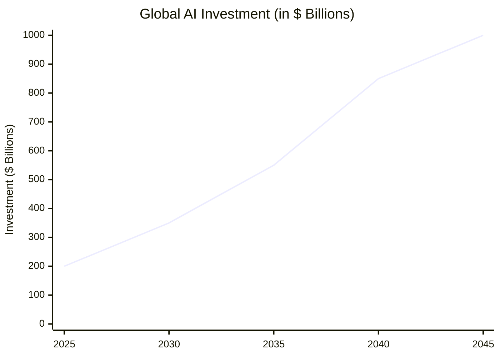
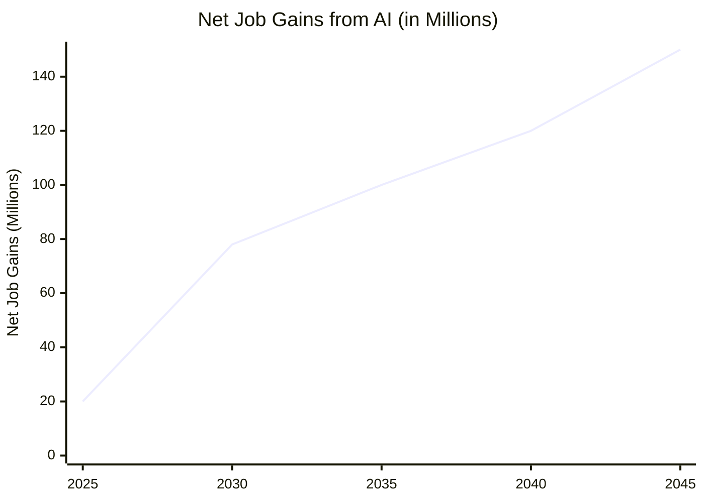
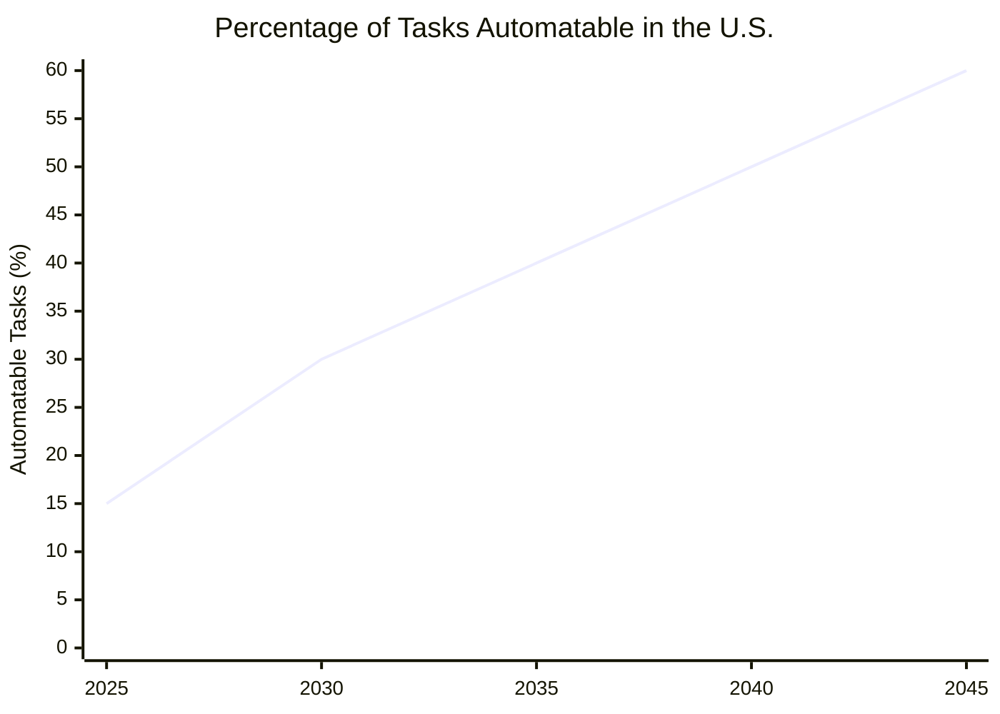
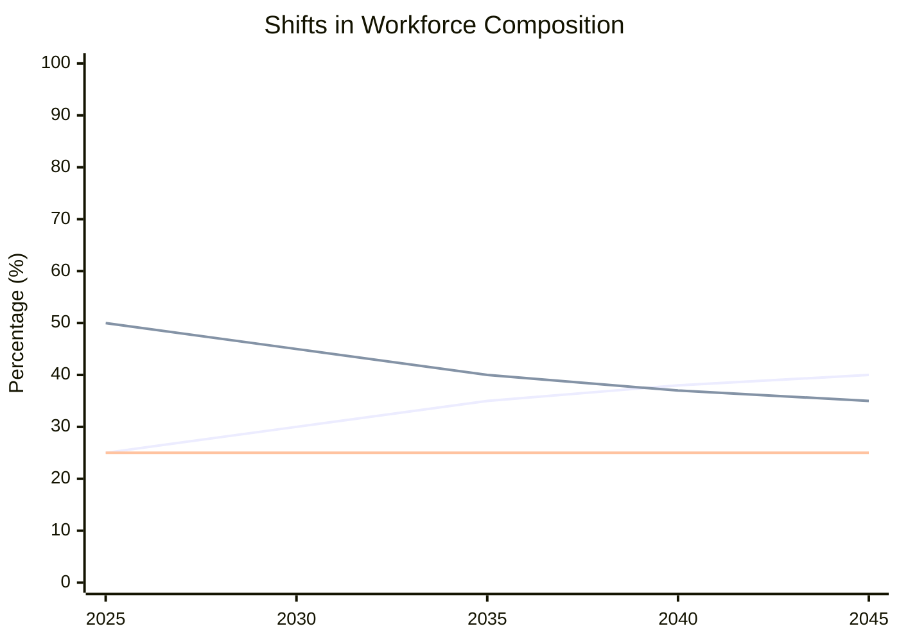

# The Transformative Journey of AI Over the Next Two Decades

Artificial Intelligence (AI) has quietly woven itself into the fabric of our daily lives, from the virtual assistants in our phones to the algorithms deciding what we see online. But as we peer into the horizon of the next 10 to 20 years, it becomes clear that these early steps are merely the beginning of an extraordinary journey. In this narrative-style article, we explore how AI may revolutionize industries, reshape job markets, and redefine social structures by 2035 and 2045. Along the way, we will illustrate key projections with visual charts to show where we’re headed—and why it matters.

---

## Table of Contents
1. [A Glimpse into Our AI Future](#a-glimpse-into-our-ai-future)  
2. [The Rise of AI Across Industries](#the-rise-of-ai-across-industries)  
   - [Software Engineering](#software-engineering)  
   - [Hardware and Semiconductor Engineering](#hardware-and-semiconductor-engineering)  
   - [AI Engineering](#ai-engineering)  
   - [Robotics](#robotics)  
   - [Transportation and Logistics](#transportation-and-logistics)  
   - [Healthcare and Biotechnology](#healthcare-and-biotechnology)  
   - [Finance and Insurance](#finance-and-insurance)  
   - [Retail and E-Commerce](#retail-and-e-commerce)  
   - [Agriculture and Food Systems](#agriculture-and-food-systems)  
   - [Energy and Utilities](#energy-and-utilities)  
   - [Cybersecurity and Privacy](#cybersecurity-and-privacy)  
   - [Media, Entertainment, and Creative Industries](#media-entertainment-and-creative-industries)  
3. [Shifting Sands of the Job Market](#shifting-sands-of-the-job-market)  
4. [Economic Tides and Global Implications](#economic-tides-and-global-implications)  
   - [U.S. Outlook](#us-outlook)  
   - [Worldwide Scenario](#worldwide-scenario)  
5. [Social Ripples and Ethical Dilemmas](#social-ripples-and-ethical-dilemmas)  
   - [Wealth Disparity](#wealth-disparity)  
   - [Warfare and Security](#warfare-and-security)  
   - [Societal Shifts](#societal-shifts)  
6. [Conclusion: Navigating the AI Frontier](#conclusion-navigating-the-ai-frontier)  
7. [Visual Exhibits: Where Data Meets Imagination](#visual-exhibits-where-data-meets-imagination)  
8. [References and Sources](#references-and-sources)  

---

## A Glimpse into Our AI Future

Picture yourself waking up in 2035. Your home adjusts the temperature based on your sleep quality, your daily schedule is optimized by an intelligent planner, and a self-driving taxi takes you to work. By the time you get there, robots have already done the early shift’s repetitive tasks, waiting for you to provide the nuanced judgment only humans still excel at.

Fast-forward another decade—now it’s 2045. AI is everywhere, from neuromorphic chips in our handheld devices to autonomous robots that navigate disaster zones without endangering human rescuers. This may sound like science fiction, but experts believe such advancements are well within reach, given current trends. In the next sections, we’ll dive into the details of how AI could reshape our professional and personal lives, supported by tangible projections.

---

## The Rise of AI Across Industries

Artificial Intelligence is far from a single-industry phenomenon. Its tentacles reach into virtually every corner of the economy, promising massive gains in efficiency, innovation, and convenience. Below is a look at how AI might reshape a variety of fields—both familiar and emerging—over the next two decades.

### Software Engineering
For many, the rise of AI in **Software Engineering** is the most immediately visible. By 2035, AI-assisted development tools could automate *30–40%* of routine coding tasks, helping engineers build software faster and with fewer errors. Subsequently, by 2045, as much as *70%* of boilerplate or repetitive programming could be handled by AI. This transition will shift the focus of human engineers toward **system architecture**, **strategic design**, and **innovative problem-solving**. Specialized roles in **AI governance**, **algorithmic fairness**, and **software ethics** will also gain momentum.

### Hardware and Semiconductor Engineering
Within the **Hardware and Semiconductor** sectors, demand for specialized AI chips—ranging from **GPUs** and **TPUs** to **neuromorphic processors**—will surge at *25–30%* annual growth. As AI workloads proliferate in data centers and edge devices, hardware engineers will concentrate on **low-power designs**, **3D chip stacking**, and **custom accelerators**. By the mid-2040s, **brain-inspired (neuromorphic) computing** may achieve **10–100x** energy efficiency boosts, enabling “ambient AI” where everything from smartphones to household appliances runs complex algorithms locally.

### AI Engineering
**AI Engineering**, **Data Science**, and **Machine Learning Operations (MLOps)** are forecast to be among the fastest-growing career tracks. Investment in AI is slated to exceed **\$200 billion** globally by the mid-2020s, fueling the need for experts who can handle the entire pipeline—from raw data ingestion and model training to deployment, scaling, and continuous monitoring. As AI systems become more deeply embedded in critical infrastructure (e.g., healthcare, finance, public utilities), **AI regulatory specialists** and **compliance officers** will also become essential.

### Robotics
The **Robotics** field has already seen AI-driven breakthroughs in **manufacturing** and **logistics**, where up to *40%* of tasks could be automated by 2035. Beyond that, autonomous machines will step into increasingly **unstructured environments**, such as construction sites or disaster zones, necessitating advanced **computer vision** and **decision-making**. By 2045, “cobots” and wearable exoskeletons could reduce workplace injuries by *50%*, while cutting operational costs and enhancing productivity in physically demanding industries.

### Transportation and Logistics
Few sectors will feel the impact of AI more than **Transportation and Logistics**. By 2035, self-driving vehicles and smart routing solutions could replace *20–30%* of human drivers, slashing labor and fuel expenses. By 2040, fully autonomous fleets might handle up to *70%* of global logistics operations in certain regions. The ripple effects will be widespread, touching **supply-chain management**, **warehouse optimization**, and **international freight**. AI-driven predictive analytics will also streamline shipment scheduling and inventory management, reducing waste and downtime.

### Healthcare and Biotechnology
**Healthcare** stands poised to benefit immensely from AI. By the early 2030s, **AI-driven diagnostics** may dramatically improve detection rates for conditions like cancer or heart disease. **Personalized medicine**—where patients receive custom treatment plans based on genetic and lifestyle data—will become increasingly achievable. Meanwhile, **Biotechnology** will leverage AI for accelerated **drug discovery**, **genome editing**, and the development of advanced therapies. Over the long term, AI might handle everything from real-time patient monitoring to AI-assisted surgeries using robotically precise instruments.

### Finance and Insurance
The **Finance** and **Insurance** industries have been quick to adopt AI for **risk assessment**, **fraud detection**, and **automated underwriting**. By 2035, machine learning models could handle a large portion of routine compliance tasks and claims processing—resulting in faster turnaround times and fewer human errors. **Algorithmic trading** is also expected to become more sophisticated, with AI predicting market trends in real time. However, as reliance on AI grows, so does the need for **AI auditors** and **transparency experts** to ensure decisions are fair and non-discriminatory.

### Retail and E-Commerce
In the **Retail** and **E-Commerce** arenas, AI is transforming everything from **customer analytics** to **inventory management**. Automated chatbots, personalized shopping recommendations, and dynamic pricing models will become the norm by 2035. Brick-and-mortar stores may see **robotic stocking**, **smart shelves**, and cashier-less checkouts. By 2045, most retailers could function with minimal on-site staff, using AI to predict shopping patterns, manage supply chains, and customize each consumer’s experience.

### Agriculture and Food Systems
**Agriculture** is increasingly turning to AI for **precision farming**, where data-driven techniques optimize water usage, fertilizers, and crop management. By the mid-2030s, autonomous drones and robotic harvesters might handle up to *20–30%* of field tasks, improving yields and reducing labor shortages. **Vertical farming** and **automated greenhouses**—powered by AI-enabled climate control—will likely expand in urban areas. Over a 20-year horizon, AI could help address **global food security** by boosting efficiency and productivity in farming practices worldwide.

### Energy and Utilities
The **Energy** sector, including **renewable energy** and **utilities**, is on the cusp of an AI-driven revolution. Predictive analytics can already optimize power grids, reducing peak loads and preventing blackouts. By 2035, **smart energy grids** might shift resources in real time based on consumption patterns. In addition, AI-powered **weather forecasting** models could significantly enhance the reliability of solar and wind energy. By 2045, an AI-centric “smart grid” could link households, energy storage facilities, and power plants into a seamlessly balanced system that reduces waste and cuts costs.

### Cybersecurity and Privacy
As AI proliferates, **Cybersecurity** must keep pace. By 2035, automated threat detection could handle routine intrusions and patch vulnerabilities without human intervention. But the same AI tools can also be wielded by malicious actors, fueling an arms race in cyberspace. Demand for **cybersecurity analysts**, **ethical hackers**, and **AI-driven defense systems** will skyrocket, along with the need for **privacy-preserving technologies** like differential privacy and homomorphic encryption. By 2045, a comprehensive AI-based security framework could become a universal requirement for all connected devices.

### Media, Entertainment, and Creative Industries
Surprisingly, AI’s influence extends to **Media, Entertainment, and the Arts**. Already, deep learning algorithms can generate music, write news articles, or craft visual art. Over the next decade, **hyper-personalized content**—tailored to individual tastes—could flood streaming services and gaming platforms. By 2045, immersive **virtual reality (VR)** and **augmented reality (AR)** experiences may blend seamlessly with AI-driven storylines, creating interactive worlds where the user’s every action influences a dynamically generated narrative. However, the blending of synthetic media and reality will also raise urgent questions about authenticity and intellectual property.

---

## Shifting Sands of the Job Market

From **software development** to **agriculture**, **telemedicine** to **transport logistics**, AI’s far-reaching capabilities suggest that few industries will remain untouched. By 2035, we will see major efficiencies and new job categories in these sectors. By 2045, AI’s integration may be so pervasive that it feels like an invisible operating system for the global economy—redefining how we work, communicate, and innovate every single day.

Every industrial revolution sparks worry about job displacement, and AI is no exception. But while certain repetitive tasks will be automated, many experts, including those at the World Economic Forum, argue that by 2030 AI could yield **78 million** net new jobs—*more* than it replaces. The real question is how societies will retrain and upskill their workforces.

In the U.S., about **30%** of routine tasks could be automated by 2030. Yet positions in AI engineering, robotics, data science, and oversight (like algorithmic ethics) are poised for rapid growth. This shift underscores the pressing need for new education models that emphasize coding, critical thinking, and data literacy. After all, the best insurance against obsolescence in an AI-driven world is adaptability.

---

## Economic Tides and Global Implications

### U.S. Outlook

Starting as early as 2027, AI’s impact on the U.S. GDP could become noticeable, potentially adding **1–1.5%** to annual growth by 2035. If these gains persist and compound, by 2045 AI could contribute a staggering **\$5–7 trillion** to the U.S. economy.

Venture capital and corporate investments in AI will likely skyrocket, especially in autonomous vehicles, advanced manufacturing, and precision healthcare. Government support might also intensify, aiming to stay competitive and foster breakthroughs in AI research and development.

### Worldwide Scenario

On the global stage, AI’s contribution could reach **\$15.7 trillion** by 2030, fueled by productivity gains and novel products. Developed countries with robust digital infrastructures are positioned to reap the biggest rewards, while emerging economies face challenges around technology adoption and policy frameworks.

These disparities raise a critical issue: Will AI accelerate the gap between tech-savvy nations and those still catching up? Ultimately, collaboration, cross-border partnerships, and accessible education will be essential for more equitable development of AI capabilities worldwide.

---

## Social Ripples and Ethical Dilemmas

### Wealth Disparity

AI may widen existing wealth gaps if high-skilled workers reap most of the benefits, leaving others behind. During 2025–2035, wage disparities might grow as certain tasks become automated. By 2045, we could see serious imbalances unless proactive policies—such as universal basic income (UBI), retraining programs, or taxes on robotics—are put in place to cushion the impact.

### Warfare and Security

The military domain is already exploring AI-driven drones, autonomous weapons, and advanced surveillance. This prompts concerns of a global arms race—one where algorithms, not soldiers, become key assets. International treaties and robust regulatory mechanisms could play an increasingly critical role in preventing misuse.

Simultaneously, cyber warfare will likely evolve as AI enhances both offensive hacking and defensive measures. Collaborative cybersecurity frameworks may become a core element of global diplomacy.

### Societal Shifts

Healthcare and education stand to benefit enormously from AI. Imagine AI-assisted medical diagnostics that catch diseases earlier or personalized learning platforms that adapt to a child’s unique pace. That said, data privacy, ethical design, and the risk of biased algorithms remain pressing challenges.

Conversations around transparency and accountability in AI systems will intensify, leading to stricter legal frameworks. Citizens, NGOs, and governments will all have a stake in ensuring AI is used responsibly.

---

## Conclusion: Navigating the AI Frontier

In the grand tapestry of technology, AI appears poised to be one of the defining forces of our age. By 2035, we can expect dramatic strides in automation, specialized AI roles, and economic growth, interwoven with debates on job displacement and social equity. By 2045, AI may be as commonplace as electricity—an invisible yet indispensable undercurrent.

Our collective task is to guide this transformation in a way that balances innovation with ethics, prosperity with fairness. As with any frontier, it’s both exciting and perilous, holding promise for monumental leaps in human capability but also cautionary tales if left unchecked. The time to prepare, collaborate, and adapt is now.

---

## Visual Exhibits: Where Data Meets Imagination

### Exhibit A: Global AI Investment (2025–2045)

**Interpretation**: Investment in AI is expected to rise rapidly as tech firms and governments accelerate research and deployment.

---

### Exhibit B: Global Net Job Gains from AI (2025–2045)

**Interpretation**: While some jobs will be lost to automation, new AI-related roles may outnumber those displaced—assuming robust retraining efforts and inclusive growth.

---

### Exhibit C: AI Automation of Tasks in the U.S. (2025–2045)

**Interpretation**: Initially, AI automates repetitive tasks in industries like customer service and manufacturing. Over time, more complex tasks also become feasible to automate.

---

### Exhibit D: Shifts in Workforce Composition (2025–2045)

**Interpretation**: The workforce composition is shifting towards more high-skill roles as AI-driven automation handles mid-skill and low-skill tasks.

---

These visualizations utilize the `xychart-beta` directive in Mermaid.js to present the data clearly. Ensure that your Mermaid.js version supports this feature, as it may be in beta. 

For more details on Mermaid.js's XY chart syntax, refer to the official documentation.  
---

## References and Sources

- **World Economic Forum**: *The Future of Jobs Report*  
- **McKinsey Global Institute**: *Notes From the AI Frontier*  
- **PwC**: *Global Artificial Intelligence Study*  
- Academic papers, think-tank research, and market analyses  

*Disclaimer: These projections are based on current trends and expert estimates. Real-world outcomes may vary due to unforeseen policy decisions, technological leaps, or shifts in societal values.*
