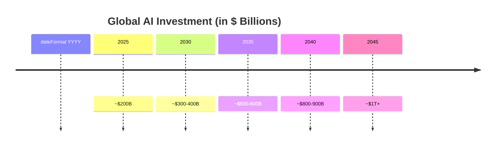
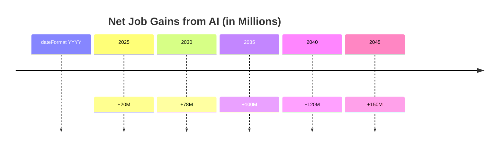
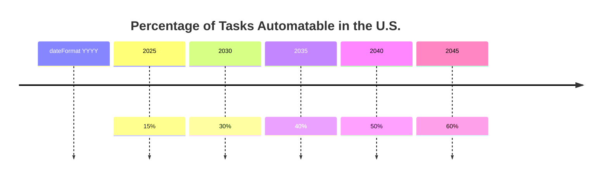
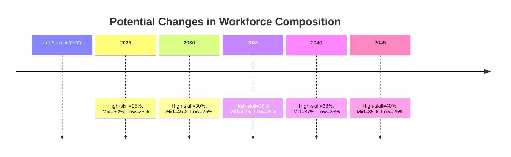

# The Transformative Impact of AI Over the Next Two Decades  
**(2025–2035 and 2025–2045)**  

Artificial Intelligence (AI) is advancing at a breathtaking pace. From self-driving vehicles to virtual assistants, these technologies are already reshaping our everyday lives. But what does the future hold—especially over the next 10 to 20 years? In this article, we’ll explore current projections about AI’s economic, social, and industrial impacts, illustrating key trends with easy-to-understand **timeline** charts.

---

## 1. AI’s Expanding Role Across Industries  

### 1.1 Software Engineering  
- **2025–2035**  
  - **Automated Coding**: AI-driven assistants could automate *30–40%* of routine programming tasks, potentially halving development time.  
  - **Evolving Skill Sets**: With basic coding offloaded to AI, software engineers will focus more on system design, strategic integration, and creative problem-solving.  

- **2025–2045**  
  - **Advanced Automation**: By 2045, as much as *70%* of common coding tasks might be automated, further elevating roles in AI governance and algorithmic transparency.  
  - **High-Level Roles**: System architects and AI ethics specialists could see demand grow by *60–80%*.

### 1.2 Hardware Engineering  
- **2025–2035**  
  - **Surge in AI Chips**: Demand for specialized AI chips (GPUs, TPUs) is expected to grow by *25–30%* annually.  
  - **Efficiency Race**: Energy-efficient designs are essential as AI spreads to phones, smart home devices, and industrial sensors.

- **2025–2045**  
  - **Neuromorphic Breakthroughs**: Brain-inspired hardware could achieve *10–100x* gains in energy efficiency.  
  - **Everywhere, All at Once**: By 2045, AI accelerators may be in nearly every electronic device, sustaining strong demand for hardware engineers.

### 1.3 AI Engineering  
- **2025–2035**  
  - **Growing Investment**: Global investment in AI could exceed *\$200 billion* by 2025, driving steady demand for AI engineers.  
  - **Rise of MLOps**: Engineers will focus on end-to-end AI systems—development, deployment, and monitoring at scale.

- **2025–2045**  
  - **Ethics and Regulation**: Roles in responsible AI, bias detection, and compliance will expand as legal frameworks tighten.  
  - **Ambient AI**: Seamless AI (“ambient AI”) in everyday devices will require on-device learning techniques and data privacy safeguards.

### 1.4 Robotics Engineering  
- **2025–2035**  
  - **Manufacturing & Logistics**: AI-driven robots could handle up to *40%* of tasks, boosting efficiency and reducing human error.  
  - **Service Robotics**: Hospitals, hotels, and retail may increasingly deploy robots for check-in, deliveries, and patient support.

- **2025–2045**  
  - **Advanced Autonomy**: Robots will become more adept at unstructured tasks, from construction to disaster relief.  
  - **Human Augmentation**: Wearable exoskeletons and cobots could cut workplace injuries by *50%*.

### 1.5 Transportation and Logistics  
- **2025–2035**  
  - **Autonomous Vehicles**: Self-driving cars may replace *20–30%* of human drivers in trucking and ride-hailing.  
  - **Smarter Logistics**: AI-optimized routing and demand forecasting could reduce operational costs by *15%*.

- **2025–2045**  
  - **Driverless Fleets**: By 2040, *70%* of logistics in some regions could be fully autonomous.  
  - **Connected Supply Chains**: Globally, AI-driven inventory and routing management will minimize waste and downtime.

---

## 2. Job Market Transformations  

AI will displace some routine tasks while creating a surge in new roles related to development, deployment, and regulation.

- **Displacement vs. Creation**  
  - **By 2030**: In the U.S., about 30% of routine tasks could be automated. Globally, the World Economic Forum (WEF) projects **78 million** net new jobs, provided adequate reskilling is available.  
- **Skills Realignment**  
  - **High-Skilled Roles**: Data scientists, AI ethicists, and robotics experts will thrive.  
  - **Mid-/Low-Skilled Roles**: Repetitive tasks face higher risk, highlighting the importance of lifelong learning and upskilling.

---

## 3. Economic Projections  

### 3.1 U.S. Economic Impact  
- **GDP Growth**  
  - By **2027**, AI could add *1–1.5%* to annual GDP growth, compounding to a *\$5–7 trillion* impact by 2045.  
- **R&D and Investment**  
  - Venture capital and corporate spending on AI will remain strong, especially in autonomous systems, healthcare, and advanced manufacturing.

### 3.2 Global Economic Impact  
- **Productivity Gains**  
  - PwC estimates AI could boost global GDP by *\$15.7 trillion* by 2030, thanks to efficiency gains and new product innovations.  
- **Uneven Benefits**  
  - Advanced economies stand to benefit most, while developing regions may lag without infrastructure and supportive policies.

---

## 4. Societal Impacts  

### 4.1 Wealth Disparity  
- **Short Term (2025–2035)**  
  - Wage gaps may widen if governments don’t invest in inclusive education and retraining.  
  - Possible reforms: capital gains or robot taxes to fund social programs.  

- **Long Term (2025–2045)**  
  - Without targeted interventions, income inequality could intensify.  
  - Universal Basic Income (UBI) discussions may gain momentum if job displacement accelerates.

### 4.2 Warfare and Global Security  
- **Autonomous Weapons**  
  - Militaries are exploring AI-driven drones and defense systems, prompting calls for arms-control treaties.  
- **Cyber Threats**  
  - AI-enabled hacking could escalate digital espionage, requiring stronger international cybersecurity standards.

### 4.3 Societal Changes  
- **Healthcare and Education**  
  - AI aids doctors and teachers through better diagnostics and personalized learning. Full replacement of these professionals is unlikely; rather, AI becomes a tool for efficiency and reach.  
- **Ethics and Privacy**  
  - Concerns over surveillance, bias in decision-making, and personal data protection will drive tighter regulations.

---

## 5. Putting It All Together  

Over the next two decades, AI will weave itself into nearly every facet of daily life. In the near term (**2025–2035**), expect swift automation of routine tasks, alongside surging demand for AI-skilled professionals. Looking further ahead (**2025–2045**), sophisticated AI systems will be deeply integrated in everything from transportation to manufacturing and healthcare.

When approached responsibly—with supportive policies, ethical frameworks, and robust educational initiatives—AI can boost productivity, enhance healthcare, reduce drudgery, and even narrow some social divides. Achieving these benefits, however, demands collaboration, vigilance, and foresight from policymakers, businesses, and citizens.

---

## 6. Illustrating the Trends: Timeline Diagrams  

Below are **Mermaid** timelines (a more widely supported diagram type than experimental bar charts). Each is followed by a quick explanation.

### 6.1 Global AI Investment (2025–2045)

- **2025**: Around \$200 billion  
- **2030**: \$300–\$400 billion  
- **2035**: \$500–\$600 billion  
- **2040**: \$800–\$900 billion  
- **2045**: \$1 trillion+  

> *Explanation*: Investment in AI is expected to soar as both companies and governments race to adopt the latest innovations.

---

### 6.2 Global Net Job Gains from AI (2025–2045)

- **2030**: *+78 million* net new jobs globally (WEF projection, assuming robust upskilling)  
- **2045**: Potentially *+150 million*, depending on broader economic conditions  

> *Explanation*: While automation may replace some jobs, new opportunities in AI, data analysis, robotics, and other tech fields could outweigh losses—if training programs keep up.

---

### 6.3 AI Automation of Tasks in the U.S. (2025–2045)

- **2025**: ~15% of tasks face automation  
- **2030**: ~30% automation feasible  
- **2045**: Up to *60%* automated in certain industries  

> *Explanation*: Early automation targets repetitive tasks. Over time, more complex jobs also become candidates for AI-driven tools.

---

### 6.4 Potential Shifts in Income Distribution

- **High-Skilled Roles**: Could climb from ~25% to ~40% of the workforce by 2045  
- **Mid-Skilled Roles**: At risk without upskilling, potentially dropping from 50% to 35%  
- **Low-Skilled Roles**: Remain constant in share at 25%, but wage pressure may intensify  

> *Explanation*: AI demands specialized skills, so the percentage of high-skilled roles may grow substantially, while mid-skilled roles risk automation.

---

## References and Sources  
- **World Economic Forum**: *The Future of Jobs Report*  
- **McKinsey Global Institute**: *Notes From the AI Frontier*  
- **PwC**: *Global Artificial Intelligence Study*  
- Various academic papers and market analyses  

*Disclaimer: These projections are based on current data and trends. Actual outcomes may vary due to legislative changes, technological breakthroughs, and evolving market dynamics.*
